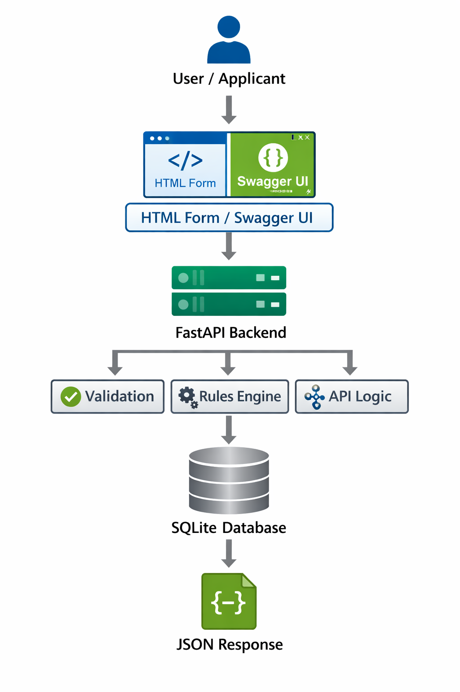
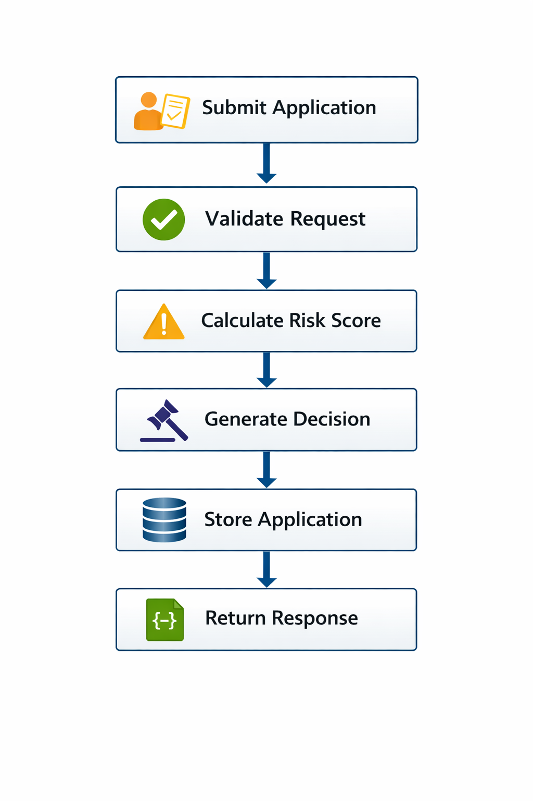

# Insurance Underwriting Platform


A portfolio-ready insurance underwriting platform that simulates a digital application intake and decision workflow using FastAPI, SQLAlchemy, SQLite, and business-rule processing.

## Why I Built This

I built this project to demonstrate API design, backend development, data modeling, business workflow automation, and technical documentation in a way that reflects real-world platform and solutions engineering work.

## Highlights

- API-first underwriting workflow
- Risk scoring and decision engine
- Database-backed application storage
- Swagger UI for testing and demonstration
- Technical documentation for architecture, workflow, and business context
- Portfolio-ready structure for GitHub presentation

## Features
- Submit insurance applications
- Calculate underwriting risk
- Return approval decision
- Store application records
- View all submitted applications
- Test endpoints using Swagger UI
- Simple HTML frontend

## Tech Stack
- FastAPI
- Python
- SQLAlchemy
- SQLite
- HTML / JavaScript
- GitHub

## Project Structure

```text
insurance-underwriting-platform/
├── app/
│   ├── main.py
│   ├── database.py
│   ├── models.py
│   ├── schemas.py
│   └── rules.py
├── requirements.txt
├── .gitignore
├── README.md
├── index.html
├── run.sh
└── run.bat
```

## Run the Project

### 1. Create virtual environment
```bash
python -m venv venv
```

### 2. Activate it
Windows:
```bash
venv\Scripts\activate
```

Mac/Linux:
```bash
source venv/bin/activate
```

### 3. Install dependencies
```bash
pip install -r requirements.txt
```

### 4. Start API
```bash
uvicorn app.main:app --reload
```

### 5. Open Swagger
```text
http://127.0.0.1:8000/docs
```

### 6. Open the frontend
Open `index.html` in your browser and submit a sample application.

## Example Decisions
- Low risk -> Approved
- Medium risk -> Manual Review
- High risk -> Declined

## Sample API Payload

```json
{
  "full_name": "Jane Smith",
  "age": 42,
  "smoker": "no",
  "annual_income": 85000,
  "coverage_amount": 250000
}
```
## Screenshots

Screenshots are available in `docs/screenshots/` and can be added here as the project evolves:
- Swagger API interface
- Application submission example
- Approved response example
- Terminal startup view
- Project structure in VS Code
## Next Improvements
- Add audit logging
- Add JWT authentication
- Replace SQLite with PostgreSQL
- Replace HTML form with React frontend
- Add automated tests
- Add GitHub Actions CI

## Architecture Diagram



## Workflow Diagram




